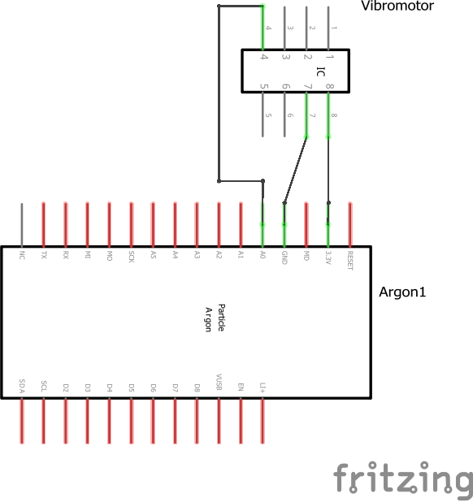

# BarDevice

A Particle project named WearableDevice.
Firmware for bar wearable device, for alerting user when bar pitch is beyond a certain threshold.
To be used in conjunction with a [BarDevice](https://github.com/BrentonAD/SIT730-ProjectPrototype-BarDevice)

## Description
The firmware of the wearable device is set to consistently scan for Bluetooth traffic with a specific signature. Inside the packet is the transmitted float of the tilt. The vibration motor is activated if the tilt value is beyond a certain threshold and is proportional the tilt using PWM.

## Architecture
For the expected connectivity of the system, see circuit schematic below:



The required hardware is as follows:
- Particle Argon
- Vibration motor (C1026B002F with included DMG3420U  MOS-FET)

## Repository Structure

#### ```/src``` folder:  
This is the source folder that contains the firmware files for your project. It should *not* be renamed. 
Anything that is in this folder when you compile your project will be sent to our compile service and compiled into a firmware binary for the Particle device that you have targeted.

Particle library dependencies are specified in the `project.properties` file referenced below.

#### ```.ino``` file:
This file is the firmware that will run as the primary application on your Particle device. It contains a `setup()` and `loop()` function, and can be written in Wiring or C/C++. For more information about using the Particle firmware API to create firmware for your Particle device, refer to the [Firmware Reference](https://docs.particle.io/reference/firmware/) section of the Particle documentation.

#### ```project.properties``` file:  
This is the file that specifies the name and version number of the libraries that your project depends on. Dependencies are added automatically to your `project.properties` file when you add a library to a project using the `particle library add` command in the CLI or add a library in the Desktop IDE.

## Compiling your project

When you're ready to compile your project, make sure you have the correct Particle device target selected and run `particle compile <platform>` in the CLI or click the Compile button in the Desktop IDE. The following files in your project folder will be sent to the compile service:

- Everything in the `/src` folder, including your `.ino` application file
- The `project.properties` file for your project
- Any libraries stored under `lib/<libraryname>/src`